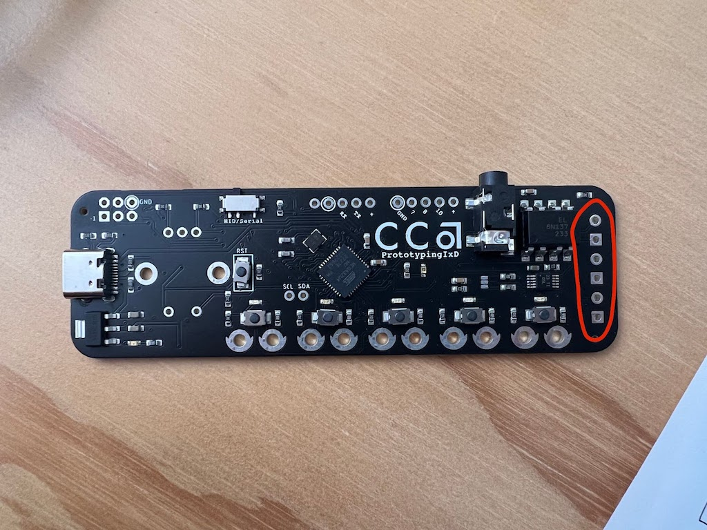

# IxD Prototyping Board

This board was designed for the Prototyping class at the California College of the Arts and it is designed to help lower the barrier of exploring physical inputs and physical computing. 

The custom board is designed to make physical computing more accessible to students and beginners by easing them into complexity a little bit at a time. The board functions as a keyboard (HID device) at first, allowing students to interact with the computer without writing any firmware. Next, the board can be talked to as a serial device, enabling more complex interactions. Finally, students can use the board as a regular Arduino, adding complexity gradually as they learn more about physical computing.

### Anatomy of the board


The prototyping board includes analog sensors, an encoder, and multiple buttons that can be used to send keyboard inputs to a computer. The analog sensors are connected to pins A4 and A5, while the encoder is connected to pins 4 and 12 with a switch on pin 6. The buttons are connected to pins A0, A1, A2, A3, 13, and 6, and each button is mapped to a corresponding keyboard key.

| Pin           | Description                                                                                                    |
|---------------|----------------------------------------------------------------------------------------------------------------|
| A4            | Analog sensor input                                                                                            |
| A5            | Light sensor input                                                                                             |
| 4             | Encoder channel A                                                                                              |
| 12            | Encoder channel B                                                                                              |
| 6             | Encoder switch                                                                                                 |
| A0            | Button input mapped to 's'                                                                                     |
| A1            | Button input mapped to 'w'                                                                                     |
| A2            | Button input mapped to 'd'                                                                                     |
| A3            | Button input mapped to 'a'                                                                                     |
| 13            | Button input mapped to spacebar                                                                                |

On the bottom of the board there is an explanation of the hardware components that are connected to the board. 
.

### Hardware Setup

1. Install female headers into the sockets for the rotary encoder.
2. Install screw terminals at the end of the board. 

### Software Setup


To talk with the board you can use HID mode or Serial mode. 

##### HID
In HID mode the board behaves like a keyboard. 

```javscript
function keyPressed() {
  if (keyCode === 65) {
    // "a" key
    console.log("a pressed");
  } else if (keyCode === 87) {
    // "w" key
    console.log("w pressed");
  } else if (keyCode === 83) {
    // "s" key
    console.log("s pressed");
  } else if (keyCode === 68) {
    // "d" key
    console.log("d pressed");
  } else if (keyCode === 32) {
    // spacebar
    console.log("spacebar pressed");
  } else if (keyCode === LEFT_ARROW) {
    // left arrow
    console.log("left arrow pressed");
  } else if (keyCode === RIGHT_ARROW) {
    // right arrow
    console.log("right arrow pressed");
  }
}
```

##### Serial
The Serial protocol sent from an Arduino contains information about different types of sensors. 
This is an example of a serial message sent:

`B0,0,0,0,0,0,A1,29,E12`

The letter "B" is used for buttons, and there are five values that correspond to each button state. The letter "A" is used for analog sensors, which measure the on board light sensor and the custom sensor that can be connected on the board. The letter "E" is used for the encoder. 

To communicate via serial you need to rely on the [p5.serialServer](https://github.com/p5-serial/p5.serialserver).


Here is an example on how to decode the data:

```javscript
var buttonsArray = [];
var analogSensorsArray = [];
var encoderValue;

var input = "B0,0,0,0,0,0,A0,65,E-40";
var decoded = decodeString(input);
``` 
  
  This is the decode method:
  
```javscript
function decodeString(input) {


  // Split the input string into 3 parts: B values, A values, and encoder value
  var parts = input.split("A");
  var secStr = parts[1].split("E");
  var aValues = secStr[0].split(",");
  var bValues = parts[0].substring(1).split(",");
  
  encoderValue = parseInt(secStr[1]);
  

  // Convert the B values into integers and store them in the buttonsArray
  for (var i = 0; i < bValues.length; i++) {
    if (bValues[i]!="")
    {
      buttonsArray[i] = parseInt(bValues[i]);
    }
  }

  // Convert the A values into integers and store them in the analogSensorsArray
  for (i = 0; i < aValues.length; i++) {
    if (aValues[i]!="")
    {
      analogSensorsArray[i] = parseInt(aValues[i]);
    }
  }
}
```


### Advanced features

The custom prototyping board includes some advanced features such as a haptic controller, audio output on pin 9, and an optocoupler (pin 8). It also offers pins 7 and 10 for additional inputs/outputs, and SCL and SDA for I2C communication.

| Pin  | Description                              |
|------|------------------------------------------|
| 11   | Haptic controller trigger (PB7)           |
| 3    | Haptic controller SCL (PD0)               |
| 2    | Haptic controller SDA (PD1)               |
| 9    | Audio output (PB5)                        |
| 8    | Optocoupler (PB4)                         |
| 7    | Free for additional input/output (PD2)   |
| 10   | Free for additional input/output (PB6)   |
| A4/SDA | Free for I2C communication (SDA)         |
| A5/SCL | Free for I2C communication (SCL)         |

### Arduino compatibility
The prototyping board is built around an ATmega 32u4 microcontroller, which is the same as the Arduino Micro. This means that the board can be programmed using the Arduino software, just like any other Arduino.

To add software to an Arduino Micro, you will need to use the Arduino IDE. Connect the board to the computer using a USB cable, select the board type "Arduino Micro" and the serial port, then write your code in the IDE and click on the "Upload" button to transfer the code to the board. 

### Credits

This effort would not be possible without the help of [Romy Aboudarham](https://github.com/romyaa), [Matt Visco](https://github.com/mattvisco) and [Hiroshi Mendoza](https://github.com/hiromendo). Special thanks to the [Hybrid Lab at CCA](https://github.com/HybridLabCCA).  


